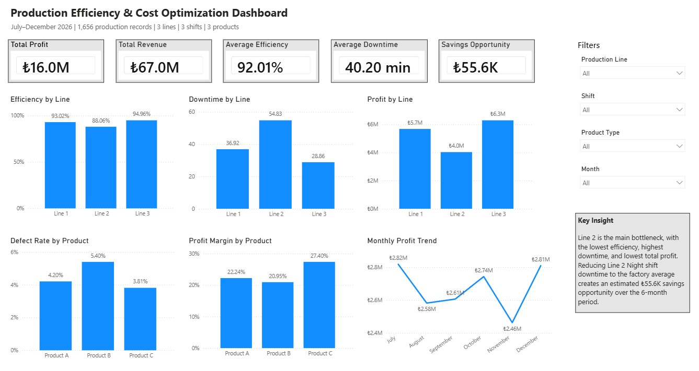
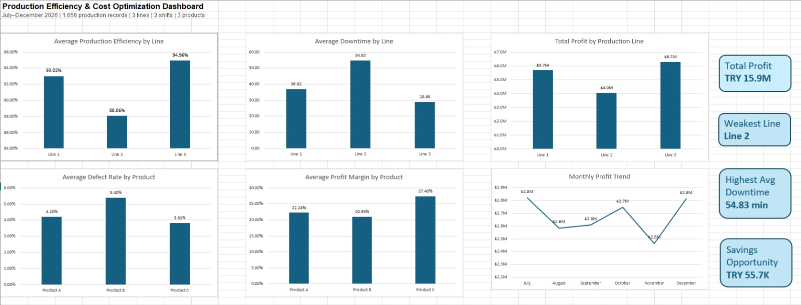
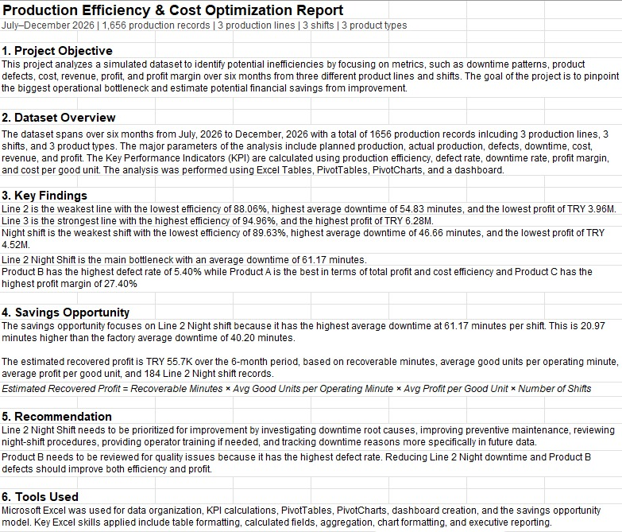

# Production Efficiency & Cost Optimization Dashboard

## Overview

This project analyzes a simulated manufacturing dataset to identify production inefficiencies, downtime patterns, defect issues, and profitability differences across production lines, shifts, and product types.

The objective was to build a data-driven operations dashboard using Excel and Power BI, then estimate the financial impact of reducing downtime in the weakest production area.

## Project Objective

The main goals of this project were to:

- Analyze production efficiency across production lines
- Identify downtime and defect-related bottlenecks
- Compare profitability by line, shift, month, and product type
- Build an Excel dashboard for operational analysis
- Build an interactive Power BI dashboard for executive reporting
- Estimate potential recovered profit from reducing downtime

## Dataset Overview

The dataset contains **1,656 production records** covering:

- 3 production lines
- 3 shifts
- 3 product types
- July–December 2026 production period

Main fields include:

- Planned Production
- Actual Production
- Defective Units
- Good Units
- Downtime Minutes
- Revenue
- Total Cost
- Profit
- Production Efficiency
- Defect Rate
- Profit Margin
- Cost per Good Unit

## Key KPIs

The following KPIs were calculated and analyzed:

- **Good Units** = Actual Production - Defective Units
- **Production Efficiency** = Actual Production / Planned Production
- **Defect Rate** = Defective Units / Actual Production
- **Downtime Rate** = Downtime Minutes / 480
- **Revenue** = Good Units × Selling Price per Unit
- **Profit** = Revenue - Total Cost
- **Profit Margin** = Profit / Revenue
- **Cost per Good Unit** = Total Cost / Good Units
- **Good Units per Operating Minute** = Good Units / Operating Minutes
- **Profit per Good Unit** = Profit / Good Units

## Tools Used

- Microsoft Excel
- Excel Tables
- PivotTables
- PivotCharts
- Power BI
- Power Query
- DAX Measures
- Dashboard Design
- Executive Reporting
- Savings Opportunity Modeling

## Dashboard Preview

### Power BI Dashboard



### Excel Dashboard



### Executive Report



## Key Findings

- **Line 2** was identified as the weakest production line, with the lowest average production efficiency, highest average downtime, and lowest total profit.
- **Line 3** was the strongest production line, with the highest average efficiency and highest total profit.
- **Night shift** showed weaker performance compared with Morning and Evening shifts.
- **Line 2 Night shift** was identified as the main bottleneck, with the highest average downtime.
- **Product B** had the highest average defect rate, indicating a potential quality issue.
- **Product C** had the highest average profit margin.
- Monthly profit remained relatively stable, but **November** showed the lowest profit during the analysis period.

## Savings Opportunity

A savings opportunity model was created for **Line 2 Night shift**.

The model compares Line 2 Night shift downtime with the factory average downtime and estimates the profit that could be recovered if downtime were reduced to the average level.

Estimated recovered profit:

**₺55.6K over the 6-month period**

Formula used:

```text
Estimated Recovered Profit =
Recoverable Minutes × Avg Good Units per Operating Minute × Avg Profit per Good Unit × Number of Shifts
```

## Business Recommendation

Line 2 should be prioritized for operational improvement because it has the lowest efficiency, highest downtime, and lowest total profit.

The first improvement focus should be **Line 2 Night shift downtime reduction**, since it was identified as the main bottleneck. Reducing its downtime to the factory average creates an estimated **₺55.6K savings opportunity** over the 6-month period.

Product B should also be reviewed for quality improvement because it has the highest defect rate. Reducing Product B defects could improve both production efficiency and profitability.

## Project Files

This repository includes:

- Excel workbook with raw data, KPI calculations, PivotTables, Excel dashboard, savings model, and executive report
- Power BI dashboard file
- Dashboard screenshots
- KPI definitions and business analysis summary

## Repository Structure

```text
production-efficiency-cost-optimization-dashboard/
│
├── README.md
│
├── excel/
│   └── production_efficiency_generated_dataset.xlsx
│
├── powerbi/
│   └── Production_Efficiency_Cost_Optimization_Dashboard.pbix
│
└── images/
    ├── powerbi-dashboard.png
    ├── excel-dashboard.png
    └── executive-report.png
```

## Project Status

Completed:

- Excel analysis
- Excel dashboard
- Power BI dashboard
- KPI calculations
- Savings opportunity model
- Executive report
- GitHub documentation

Future improvements:

- Add drill-through pages in Power BI
- Add more advanced DAX measures
- Include machine-level or operator-level data
- Build a predictive downtime or defect model
- Add scenario analysis for different downtime reduction targets
